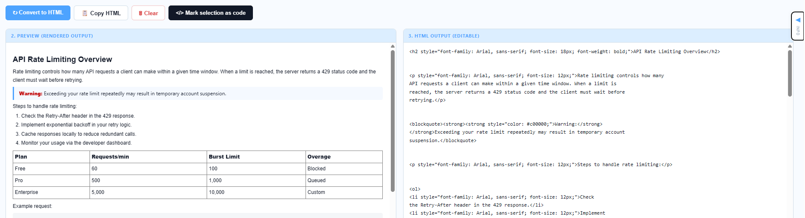
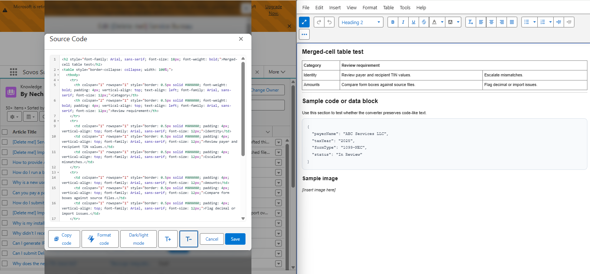
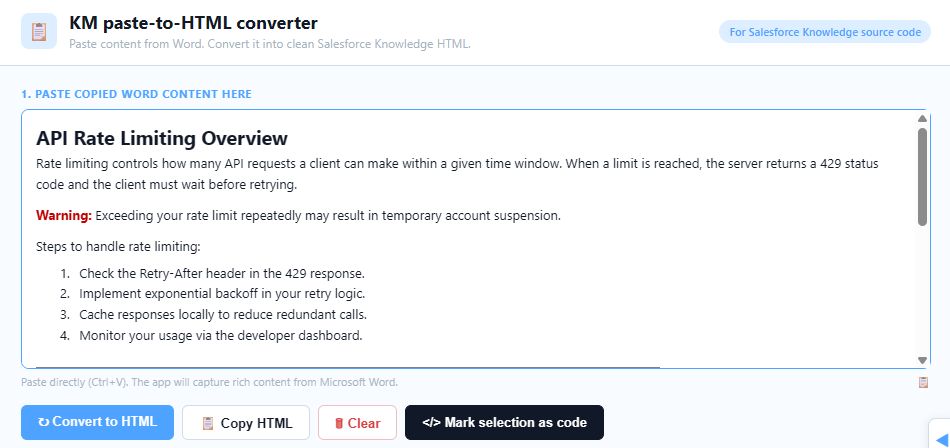
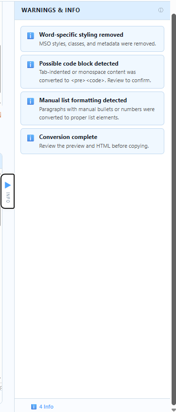

# KM HTML Converter

A lightweight browser-based tool that converts copied Microsoft Word content into cleaner, Salesforce Knowledge-ready HTML.

This project was built as an internal workflow support tool for Knowledge Management writers who regularly prepare documentation for Salesforce Knowledge. It helps reduce repetitive formatting cleanup by converting pasted Word content into structured HTML that can be reviewed, edited, copied, and pasted into a Salesforce Knowledge source editor.

## What it does

* Removes Word-specific styling and metadata, and outputs cleaner HTML with consistent inline styling
* Converts headings, paragraphs, lists, links, tables, notes, warnings, and code-like content
* Detects images and replaces them with an *[Insert image here]* placeholder for manual insertion in Salesforce
* Provides a rendered preview beside the generated HTML, updating live as you edit the HTML output
* Shows warnings and informational messages for items that need manual review

## Key features

### Word-to-HTML cleanup

The converter removes unnecessary Word-generated markup and outputs cleaner HTML with consistent inline styling.

### Salesforce Knowledge-ready output

The generated HTML uses simple formatting intended for Salesforce Knowledge source code, including Arial font styling, table borders, heading hierarchy, and readable paragraph formatting.

### Table handling

The tool preserves common table structures, including header rows, empty cells, uneven rows, nested tables, and merged cells where possible. Header rows are output with bold text and no background fill. Table width is set to 100% by default and can be adjusted by hand in the HTML output box before copying.

### Image handling

Images in the pasted content are not converted. Each image becomes an *[Insert image here]* placeholder in the output. The writer adds the actual image in Salesforce Knowledge after pasting the HTML.

### Rich-text toolbar

The paste area includes a toolbar for formatting content directly before conversion. Available controls include bold, italic, underline, heading levels, bulleted and numbered lists, font size, link insertion, code snippet marking, and undo/redo.

### Expand buttons

Each panel (paste area, HTML output, preview) has an expand button that opens it in a larger modal window. Edits made in the modal sync back to the main view in real time.

### Warning panel

The warning panel helps writers catch items that need manual review, such as images, nested tables, uneven tables, unsafe links, or possible code blocks. It slides in from the right and can be toggled open or closed.

### Live preview

The preview panel updates immediately as you edit the HTML output box. No reconversion needed to see the effect of a hand-fix.

### Unsaved-changes protection

If you try to close or navigate away from the page with unconverted or uncopied content, the browser will prompt you to confirm before leaving.

## Tech stack

* HTML
* CSS
* Vanilla JavaScript

No framework, build tool, package manager, or backend is required.

## How to use

1. Open `index.html` or [KM HTML Converter](https://nechi-nechi.github.io/km-html-converter/) in a browser.
2. Copy content from Microsoft Word.
3. Paste the content into the paste area (Ctrl+V). The app captures rich content including lists, tables, and headings.
4. Click **Convert to HTML**.
5. Review the rendered preview.
6. Check the warnings panel for items that need manual review.
7. Edit the HTML output or the paste area if needed, then reconvert.
8. Click **Copy HTML**.
9. Paste the HTML into the Salesforce Knowledge source editor.

## Screenshots

### Converted output

### Salesforce round-trip

### Paste area

### Warnings panel

## Known limitations

* **Desktop only.** The workflow assumes you are copying from Word and pasting into Salesforce on a computer. The output panels stack on narrow screens but the tool is not tuned for phones.
* **Images are not converted.** Each image becomes an *[Insert image here]* placeholder. Add the real image in Salesforce Knowledge after pasting.

## Project scope

This is a small internal productivity tool, not a full publishing system. It is designed to support a specific KM workflow: preparing cleaner HTML from Word-based article drafts for Salesforce Knowledge.
